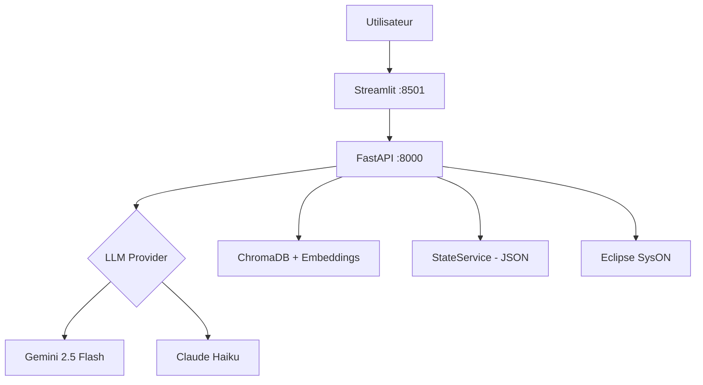

# SysAgent — Generateur automatique de modeles SysML v2

Outil de generation de modeles SysML v2 a partir de descriptions en langage naturel, suivant une approche MBSE (Model-Based Systems Engineering) en 4 niveaux (Operationnel, Fonctionnel, Logique, Technique).

Le systeme transforme des descriptions textuelles structurees en 15 packages SysML v2 syntaxiquement corrects et compatibles avec l'outil Eclipse SysON, via un pipeline LLM en 2 etapes (NL → JSON → SysML v2) enrichi par RAG sur 33 fichiers de la specification OMG.

## Fonctionnalites

- Pipeline MBSE 4 niveaux avec sections guidees par niveau
- 15 prompts SysML v2 specialises avec templates valides sur la spec OMG
- 9 regles de compatibilite SysON (RS1-RS9)
- Coherence de nommage inter-packages par extraction/injection d'identifiants
- Dual LLM : Anthropic Claude ou Google Gemini
- RAG avec ChromaDB et sentence-transformers
- Validation syntaxique du code SysML v2 genere
- Integration Eclipse SysON (push/pull)
- Interface Streamlit avec gestion de sessions

## Demarrage rapide

### Mode Docker (recommande)

```bash
git clone <repo-url>
cd sysml-agent
cp .env.example .env
# Editer .env avec votre cle API (Anthropic ou Google)
docker compose up --build
# Ouvrir http://localhost:8501
```

### Mode local (sans Docker)

```bash
./docs/05-scripts/setup.sh    # Installation (venv + dependances)
# Editer .env avec votre cle API
./docs/05-scripts/start.sh    # Lancement (backend + frontend)
# Ouvrir http://localhost:8501
# Ctrl+C pour arreter
```

Guide complet : [docs/01-guide-installation](docs/01-guide-installation/)

## Architecture



| Composant | Technologie | Role |
|-----------|-------------|------|
| Backend | FastAPI (Python) | API REST, pipeline de generation, validation |
| Frontend | Streamlit | Interface utilisateur avec sections guidees |
| SysON | Eclipse SysON v2026.1.0 | Visualisation des modeles SysML v2 |
| RAG | ChromaDB + sentence-transformers | Exemples SysML v2 de la spec OMG |

## Technologies

Python 3.10+ | FastAPI | Streamlit | Anthropic Claude / Google Gemini | ChromaDB | sentence-transformers | SysML v2 | Eclipse SysON | Docker Compose

## Documentation

| Dossier | Contenu |
|---------|---------|
| [docs/01-guide-installation](docs/01-guide-installation/) | Installation, prerequis, configuration |
| [docs/02-architecture](docs/02-architecture/) | Architecture technique, services, pipeline |
| [docs/03-strategie-prompts](docs/03-strategie-prompts/) | Strategie de prompts, regles SysON, fidelite |
| [docs/04-resultats-test-bas](docs/04-resultats-test-bas/) | Resultats du test BAS Silvercrest (4 niveaux) |

## Statistiques

- 9 140 lignes Python
- 15 prompts SysML v2 specialises
- 4 niveaux MBSE (15 packages generes)
- 33 fichiers spec OMG analyses (1 769 lignes)
- 28 endpoints API REST
