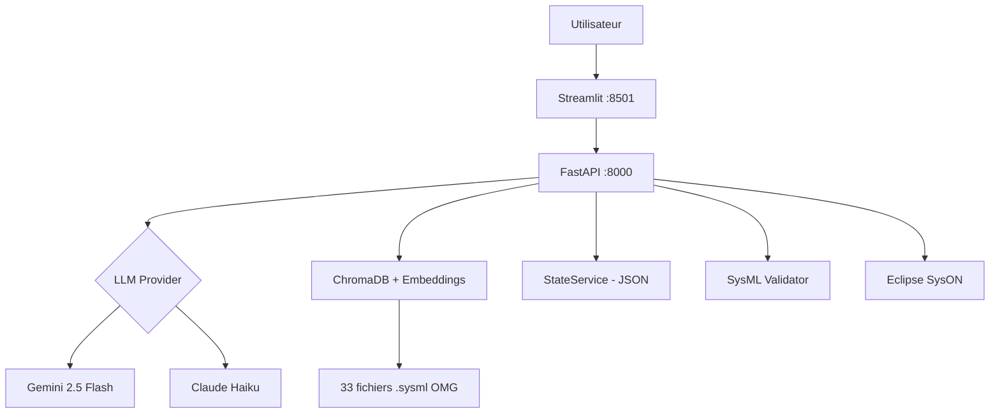

# Architecture du SysML v2 Agent

## Vue d'ensemble

Le SysML v2 Agent est une application web qui permet de generer des modeles SysML v2 a partir de descriptions en langage naturel, en suivant une approche MBSE structuree en 4 niveaux.

## Conteneurs Docker

Le systeme est compose de 4 conteneurs orchestres par `docker-compose.yml` :

| Conteneur | Image / Framework | Port | Description |
|-----------|-------------------|------|-------------|
| **backend** | FastAPI (Python 3.11) | 8000 | API REST, orchestration LLM, RAG, validation SysML v2 |
| **frontend** | Streamlit (Python 3.11) | 8501 | Interface utilisateur avec formulaires guides et visualisation |
| **syson** | Eclipse SysON v2026.1.0 | 8080 | Editeur graphique SysML v2 conforme OMG |
| **syson-db** | PostgreSQL | 5432 | Base de donnees pour les projets SysON |

### Backend (FastAPI)

Le coeur du systeme. Il expose les API REST, orchestre la generation via LLM, gere le RAG (ChromaDB + sentence-transformers) pour fournir des exemples SysML v2, valide le code genere et communique avec Eclipse SysON.

Voir [backend.md](backend.md) pour le detail des endpoints et services.

### Frontend (Streamlit)

Interface utilisateur organisee en onglets avec un workflow guide par niveaux MBSE. Le frontend communique exclusivement avec le backend via les API REST.

Voir [frontend.md](frontend.md) pour le detail de l'interface.

### Pipeline de generation

Le processus de generation transforme les sections en langage naturel en code SysML v2 via un pipeline en 2 etapes : NL vers JSON, puis JSON vers SysML v2.

Voir [pipeline-generation.md](pipeline-generation.md) pour le detail du pipeline.

### Arborescence du projet

Voir [arborescence.md](arborescence.md) pour la structure complete des fichiers.
