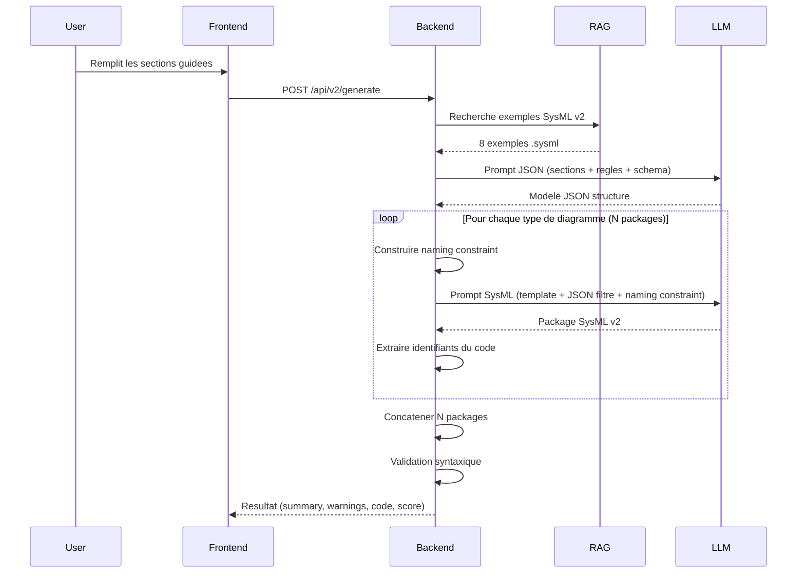

# Pipeline de generation SysML v2

## Vue d'ensemble

Le pipeline transforme des descriptions en langage naturel (sections guidees) en code SysML v2 valide. Il opere en 2 etapes principales, orchestrees par le `LevelService`.



## Etape 1 : Langage naturel vers JSON

### Entree
Les sections remplies par l'utilisateur en langage naturel.

### Traitement
Le backend construit un prompt structure contenant :
- **Sections utilisateur** : texte brut saisi par l'utilisateur
- **Regles de fidelite** : contraintes pour respecter fidelement les descriptions sans inventer d'elements
- **Regles metier** : contraintes MBSE specifiques au niveau courant
- **Schema JSON** : structure attendue du modele intermediaire (defini dans `models/schemas.py`)

Le LLM genere un modele JSON structure qui capture les elements du systeme (composants, interfaces, flux, contraintes) dans un format normalise.

### Sortie
Un objet JSON conforme au schema du niveau, servant de representation intermediaire.

## Etape 2 : JSON vers packages SysML v2

### Entree
Le modele JSON genere a l'etape 1.

### Traitement
Pour chaque type de diagramme du niveau, le backend :

1. **Construit le naming constraint** : bloc de texte listant tous les identifiants deja generes dans les packages precedents, pour assurer la coherence des references croisees
2. **Prepare le prompt SysML** contenant :
   - **Template SysML** : structure de base du package avec les patterns syntaxiques attendus
   - **JSON filtre** : sous-ensemble du modele JSON pertinent pour ce type de diagramme
   - **Naming constraint** : identifiants existants a reutiliser
   - **Regles SysON** : regles de compatibilite avec Eclipse SysON (pas de `doc`, pas de `comment`, nommage conforme)
3. **Appelle le LLM** pour generer le package SysML v2
4. **Extrait les identifiants** du code genere via `extract_identifiers_from_sysml`
5. **Fusionne les identifiants** avec ceux des packages precedents via `merge_identifiers`

### Generation sequentielle avec extraction d'identifiants

La generation des packages est **sequentielle** (pas parallele) car chaque package depend des identifiants des packages precedents :

```
Package 1 → extract_identifiers → merge_identifiers → build_naming_constraint_block
    ↓
Package 2 → extract_identifiers → merge_identifiers → build_naming_constraint_block
    ↓
Package 3 → ...
```

Ce mecanisme garantit que les references croisees entre packages sont coherentes (par exemple, un `UseCase` defini dans le package des cas d'utilisation peut etre reference dans le package des activites).

### Sortie
N packages SysML v2 concatenes, suivis d'une validation syntaxique.

## Nombre de packages par niveau

| Niveau | Packages | Total |
|--------|----------|-------|
| Operationnel (operational) | 5 | 5 |
| Fonctionnel (functional) | 3 | 8 |
| Logique (logical) | 4 | 12 |
| Technique (technical) | 3 | 15 |
| **Total** | | **15** |

Chaque niveau genere un nombre specifique de packages SysML v2, correspondant aux differents types de diagrammes MBSE de ce niveau. Au total, un modele complet comprend 15 packages SysML v2.

## Validation

Apres la concatenation des packages, le `SysMLv2Validator` effectue une validation syntaxique du code genere. Il verifie :
- La structure des packages (ouverture/fermeture des blocs)
- Les mots-cles SysML v2 valides
- Les regles de nommage
- La coherence des references

Le resultat inclut un score de validation, une liste de warnings et les erreurs eventuelles.
